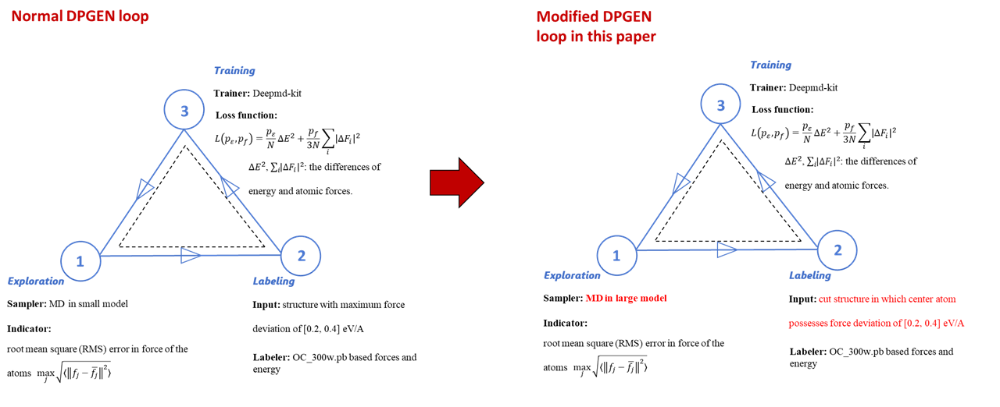

# INTRODUCTION
DPGEN typically employs a bottom-up construction approach, where density functional theory (DFT) simulations on small models are used to train structures. This means that the force fields for larger structural models are developed based on these smaller models, following a bottom-up method.

However, this approach presents two issues. Firstly, the selection of small models and their representativeness poses a challenge. Secondly, the runtime for large structural models might significantly exceed that of the DPGEN small models, raising concerns about the potential instability of the force fields during this period.

To address these issues, a top-down approach for DPGEN is proposed. This method involves initiating molecular simulations under the desired large structural models right after obtaining the initial force fields. Subsequently, using model deviation to identify atoms with significant force errors, and then employing a slicing method to construct DFT models for labeling.

# FLOWCHART

scheme of the DPGEN_mod and its difference to a normal DPGEN loop

# USAGE

First, copy y.main_iterations to z.main_iterations. Enter z.main_iterations, copy iter00 to iter01, and then go into iter01 and execute using main_control_v2.py. For each subsequent iteration, copy iter00 to the corresponding iteration number to execute.

one can mod the parameters in input.json to adjust the simulation.
